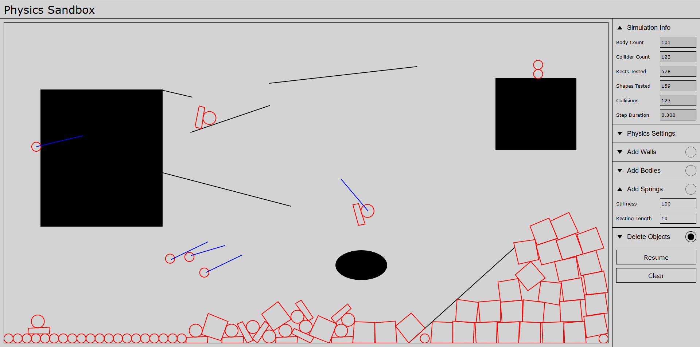
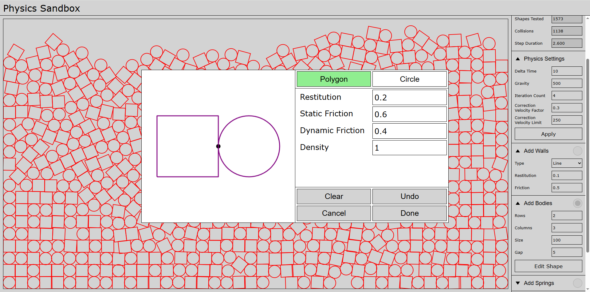

# Physics Sandbox

An online 2D physics sandbox with custom shapes and many configurable parameters.

Hosted at: https://themolish.netlify.app

## Sandbox Features
- Real-time simulation statistics
  - Body count
  - Collider count
  - Collision metrics
  - Simulation step duration
- Configurable physics settings
  - Delta time
  - Gravity
  - Solver iteration count
  - Velocity correction parameters
- Object creation tools
  - Wall drawing
    - Line
	- Rectangle
	- Oval
  - Multi-body spawn with grid layout
  - Custom shape editor
    - Drawing modes
      - Polygon
      - Rectangle
      - Circle
    - Material property configuration
      - Density
      - Restitution
      - Friction
  - Spring placement
- Interaction and editing
  - Simulation control
  - Object deletion
    - Sweep mode
  - Responsive world bounds

## Engine Features
- Colliders
  - Convex shapes
    - Circle
    - Polygon
  - Density
  - Restitution
  - Static and dynamic friction
  - Collision filter
  - Sensor only mode
- Bodies
  - Types
    - Dynamic
    - Static
  - Dynamic position
  - Dynamic velocity
  - Impulses can be applied
  - Force can be applied
  - Automatic mass computation
- Springs
  - Stiffness
  - Resting length
- Solver
  - Broad phase
    - Sweep and prune algorithm
    - Bounding rectangle test
  - Narrow phase
    - Distance test
    - Separating axis test
  - Velocity based simulation
  - Collision resolution
  - Friction resolution

## Screenshots

